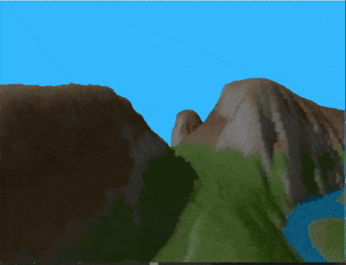

## Voxel Space - Go

VoxelSpace Golang is a basic implementation of a 2.5D rendering engine based on the Voxel Space technique, similar to ray casting. This project demonstrates how a height map and color map can be used to render a simple 3D-like scene in a 2D space.

 

## Features

- **Voxel-based Rendering:** Uses a basic Voxel Space technique for simple 3D rendering.
- **Height & Color Maps:** Renders terrain using a 1024x1024 height map and color map.
- **Simple Algorithm:** The engine processes the height and color maps and draws vertical lines based on perspective projection.
